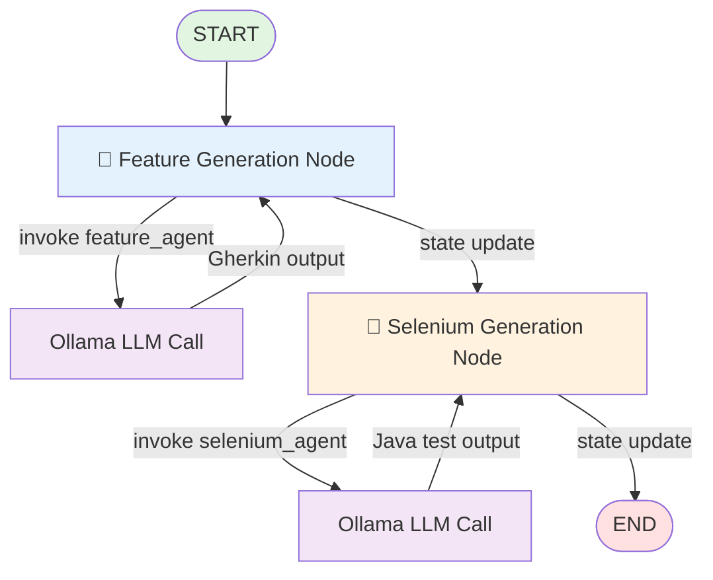
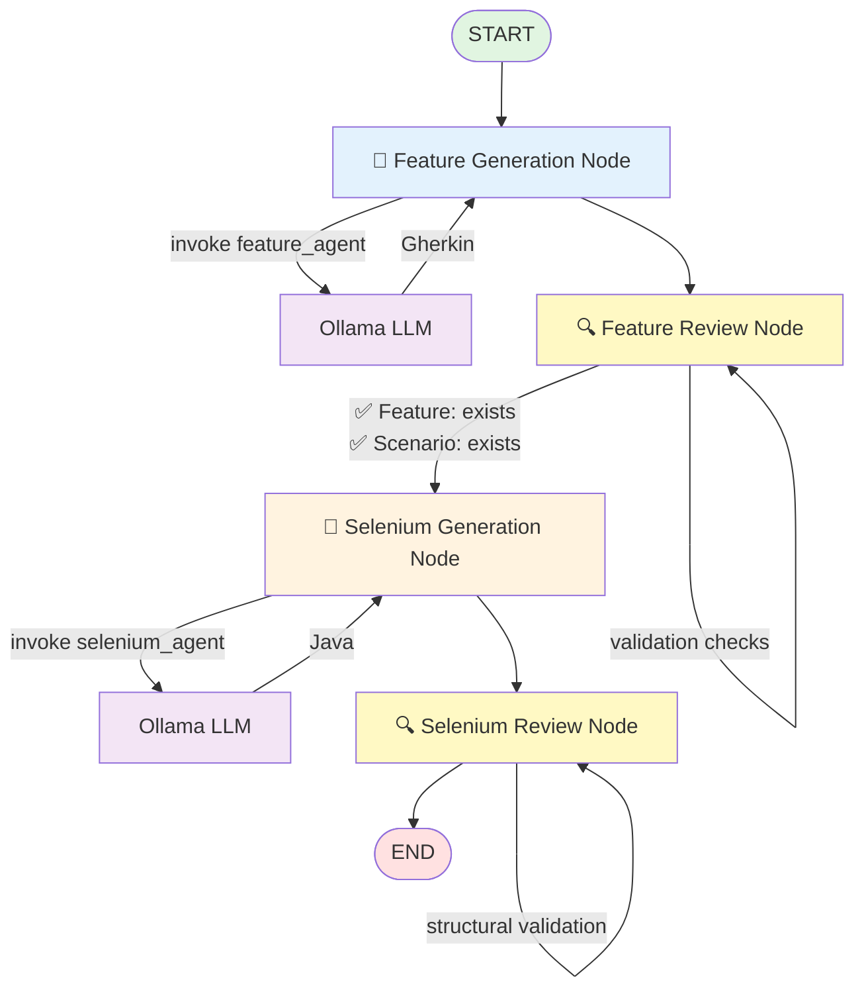
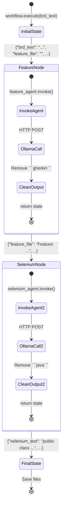

# LangGraph Workflow Architecture

## Standard Workflow Graph



## Validated Workflow Graph (with Quality Checks)



## LangGraph StateGraph Node Definitions

### Node Structure

```python
# workflow.py implementation

class AutomationWorkflow:
    def _build_workflow(self) -> StateGraph:
        workflow = StateGraph(AgentState)
        
        # Define nodes
        workflow.add_node("generate_feature", self._generate_feature_node)
        workflow.add_node("generate_selenium", self._generate_selenium_node)
        
        # Define edges (execution flow)
        workflow.set_entry_point("generate_feature")
        workflow.add_edge("generate_feature", "generate_selenium")
        workflow.add_edge("generate_selenium", END)
        
        return workflow.compile()
```

### Node Execution Details

```
┌──────────────────────────────────────────────────────────────────┐
│                   Feature Generation Node                         │
├──────────────────────────────────────────────────────────────────┤
│ Input State:                                                      │
│   - brd_text: str                                                │
│   - feature_file: "" (empty)                                     │
│   - selenium_test: "" (empty)                                    │
│   - current_step: "start"                                        │
│                                                                   │
│ Process:                                                          │
│   1. feature_agent.invoke({"messages": [...]})                   │
│   2. OllamaChatModel._generate()                                 │
│   3. HTTP POST → Ollama API                                      │
│   4. Clean markdown fences from response                         │
│                                                                   │
│ Output State:                                                     │
│   - brd_text: str (unchanged)                                    │
│   - feature_file: str (Gherkin content)                          │
│   - selenium_test: "" (still empty)                              │
│   - current_step: "feature_generated"                            │
└──────────────────────────────────────────────────────────────────┘
                            ↓
┌──────────────────────────────────────────────────────────────────┐
│                  Selenium Generation Node                         │
├──────────────────────────────────────────────────────────────────┤
│ Input State:                                                      │
│   - brd_text: str                                                │
│   - feature_file: str (Gherkin from previous node)               │
│   - selenium_test: "" (empty)                                    │
│   - current_step: "feature_generated"                            │
│                                                                   │
│ Process:                                                          │
│   1. selenium_agent.invoke({"messages": [...]})                  │
│   2. OllamaChatModel._generate()                                 │
│   3. HTTP POST → Ollama API                                      │
│   4. Clean markdown fences from response                         │
│                                                                   │
│ Output State:                                                     │
│   - brd_text: str (unchanged)                                    │
│   - feature_file: str (unchanged)                                │
│   - selenium_test: str (Java test code)                          │
│   - current_step: "automation_generated"                         │
└──────────────────────────────────────────────────────────────────┘
```

## State Flow Diagram



## Agent Invocation Flow

```
User Request
     ↓
workflow.execute(brd_text)
     ↓
StateGraph.invoke(initial_state)
     ↓
┌─────────────────────────────────────────┐
│     Node: _generate_feature_node()      │
│                                          │
│  self.feature_agent.invoke({            │
│    "messages": [                         │
│      {"role": "user",                    │
│       "content": state['brd_text']}     │
│    ]                                     │
│  })                                      │
│           ↓                              │
│  OllamaChatModel._generate()            │
│           ↓                              │
│  ollama_client.generate_text()          │
│           ↓                              │
│  requests.post(                          │
│    "http://localhost:11434/api/generate"│
│  )                                       │
│           ↓                              │
│  LLM Response: Gherkin feature file     │
│           ↓                              │
│  Clean: remove ```gherkin``` markers   │
│           ↓                              │
│  return updated state                    │
└─────────────────────────────────────────┘
     ↓
StateGraph passes state to next node
     ↓
┌─────────────────────────────────────────┐
│    Node: _generate_selenium_node()      │
│                                          │
│  self.selenium_agent.invoke({           │
│    "messages": [                         │
│      {"role": "user",                    │
│       "content": state['feature_file']} │
│    ]                                     │
│  })                                      │
│           ↓                              │
│  OllamaChatModel._generate()            │
│           ↓                              │
│  ollama_client.generate_text()          │
│           ↓                              │
│  requests.post(                          │
│    "http://localhost:11434/api/generate"│
│  )                                       │
│           ↓                              │
│  LLM Response: Java Selenium test       │
│           ↓                              │
│  Clean: remove ```java``` markers      │
│           ↓                              │
│  return final state                      │
└─────────────────────────────────────────┘
     ↓
StateGraph reaches END
     ↓
Return final_state to caller
     ↓
save_outputs(feature_file, selenium_test, base_name)
     ↓
Files saved to outputs/ directory
```

## Detailed Node Connection Map

```
AutomationWorkflow (Standard):
━━━━━━━━━━━━━━━━━━━━━━━━━━━━━━

Entry Point: "generate_feature"
    ↓
[generate_feature]  ──────→  [generate_selenium]  ──────→  END
    │                              │
    │                              │
    ├─ Agent: feature_agent        ├─ Agent: selenium_agent
    ├─ Input: brd_text             ├─ Input: feature_file
    ├─ Output: feature_file        ├─ Output: selenium_test
    └─ LLM Call: 1                 └─ LLM Call: 1


ValidatedWorkflow (With Quality Checks):
━━━━━━━━━━━━━━━━━━━━━━━━━━━━━━━━━━━━━

Entry Point: "generate_feature"
    ↓
[generate_feature] ──→ [review_feature] ──→ [generate_selenium] ──→ [review_selenium] ──→ END
    │                       │                      │                       │
    │                       │                      │                       │
    ├─ Agent: feature       ├─ Validation:        ├─ Agent: selenium      ├─ Validation:
    │  _agent               │  - Check             │  _agent               │  - Structural
    ├─ Input: brd_text      │    "Feature:"        ├─ Input: feature_file │    checks
    ├─ Output: feature      │  - Check             ├─ Output: selenium     │
    │  _file                │    "Scenario:"       │  _test                │
    └─ LLM Call: 1          └─ No LLM call        └─ LLM Call: 1          └─ No LLM call
```

## Complete System Architecture

```
┌───────────────────────────────────────────────────────────────────────────┐
│                           User Interface Layer                             │
├───────────────────────────────────────────────────────────────────────────┤
│                                                                            │
│  ┌─────────────────────┐              ┌───────────────────────┐          │
│  │   CLI (main.py)     │              │ Web UI (app.py)       │          │
│  │                     │              │                        │          │
│  │  python main.py     │              │  FastAPI Server        │          │
│  │  --brd file.txt     │              │  http://localhost:8000 │          │
│  │  --base-name Test   │              │  File Upload UI        │          │
│  └─────────┬───────────┘              └───────────┬───────────┘          │
│            │                                       │                       │
│            └───────────────────┬───────────────────┘                      │
│                                │                                           │
└────────────────────────────────┼───────────────────────────────────────────┘
                                 │
                                 v
┌───────────────────────────────────────────────────────────────────────────┐
│                       LangGraph Orchestration Layer                        │
├───────────────────────────────────────────────────────────────────────────┤
│                                                                            │
│  ┌──────────────────────────────────────────────────────────────────┐   │
│  │                    StateGraph Workflow                            │   │
│  │                                                                    │   │
│  │   START ──→ [Feature Node] ──→ [Selenium Node] ──→ END           │   │
│  │                    │                   │                           │   │
│  │                    ↓                   ↓                           │   │
│  │              feature_agent      selenium_agent                     │   │
│  │                                                                    │   │
│  └──────────────────────────────────────────────────────────────────┘   │
│                                                                            │
│  State Management:                                                        │
│  ┌────────────────────────────────────────────────────────────────┐     │
│  │  AgentState = {                                                 │     │
│  │    "brd_text": str,                                            │     │
│  │    "feature_file": str,                                        │     │
│  │    "selenium_test": str,                                       │     │
│  │    "current_step": str,                                        │     │
│  │    "messages": list                                            │     │
│  │  }                                                              │     │
│  └────────────────────────────────────────────────────────────────┘     │
│                                                                            │
└────────────────────────────────────┬───────────────────────────────────────┘
                                     │
                                     v
┌───────────────────────────────────────────────────────────────────────────┐
│                           Agent Layer (LangChain)                          │
├───────────────────────────────────────────────────────────────────────────┤
│                                                                            │
│  ┌──────────────────────────────┐    ┌──────────────────────────────┐   │
│  │      Feature Agent           │    │     Selenium Agent           │   │
│  ├──────────────────────────────┤    ├──────────────────────────────┤   │
│  │  Created with:               │    │  Created with:               │   │
│  │  create_agent()              │    │  create_agent()              │   │
│  │                              │    │                              │   │
│  │  Model: OllamaChatModel      │    │  Model: OllamaChatModel      │   │
│  │  System Prompt: QA/BDD       │    │  System Prompt: Selenium     │   │
│  │  Expert                      │    │  /Java Expert                │   │
│  │                              │    │                              │   │
│  │  Input: BRD text             │    │  Input: Feature file         │   │
│  │  Output: Gherkin feature     │    │  Output: Java test code      │   │
│  └──────────────┬───────────────┘    └──────────────┬───────────────┘   │
│                 │                                     │                    │
│                 └──────────────┬──────────────────────┘                   │
│                                │                                           │
└────────────────────────────────┼───────────────────────────────────────────┘
                                 │
                                 v
┌───────────────────────────────────────────────────────────────────────────┐
│                         LLM Backend Layer (Ollama)                         │
├───────────────────────────────────────────────────────────────────────────┤
│                                                                            │
│  ┌──────────────────────────────────────────────────────────────────┐   │
│  │                    Ollama Local Server                            │   │
│  │                http://localhost:11434/api/generate                 │   │
│  │                                                                    │   │
│  │  Models:                                                           │   │
│  │  • qwen2.5:latest  (default)                                      │   │
│  │  • qwen2.5:7b      (strong model)                                 │   │
│  │                                                                    │   │
│  │  Configuration:                                                    │   │
│  │  • Temperature: 0.2                                               │   │
│  │  • Max Tokens: 2048                                               │   │
│  │  • Timeout: 120s                                                  │   │
│  └──────────────────────────────────────────────────────────────────┘   │
│                                                                            │
└───────────────────────────────────────────────────────────────────────────┘
                                 ↓
┌───────────────────────────────────────────────────────────────────────────┐
│                            Output Layer                                    │
├───────────────────────────────────────────────────────────────────────────┤
│                                                                            │
│  ┌───────────────────────┐          ┌────────────────────────┐           │
│  │  outputs/features/    │          │  outputs/tests/        │           │
│  │                       │          │                         │           │
│  │  {base_name}.feature  │          │  {base_name}Test.java  │           │
│  │                       │          │                         │           │
│  │  Gherkin BDD format   │          │  JUnit 5 + Selenium    │           │
│  └───────────────────────┘          └────────────────────────┘           │
│                                                                            │
└───────────────────────────────────────────────────────────────────────────┘
```

## Key Observations

1. **Two LLM Calls Total**: Standard workflow makes exactly 2 HTTP requests to Ollama
2. **Sequential Execution**: Both workflows run nodes one after another sequentially
3. **State Immutability**: Each node returns a new state dict
4. **Edge Types**: Only simple edges (no conditional branching in standard workflow)
5. **Cleanup Step**: Markdown code fence removal happens in each generation node
6. **Validation Nodes**: Review nodes don't call LLM, just validate structure

## Graph Properties

| Property | Standard Workflow | Validated Workflow |
|----------|------------------|--------------------|
| **Nodes** | 2 (generate_feature, generate_selenium) | 4 (+ review nodes) |
| **Edges** | 2 (feature→selenium, selenium→END) | 4 (linear chain) |
| **LLM Calls** | 2 | 2 |
| **Validation** | None | Feature + Test validation |
| **Execution Mode** | Sequential | Sequential |
| **Entry Point** | generate_feature | generate_feature |
| **End Condition** | After selenium generation | After review_selenium |

## Data Flow Through System

```
┌─────────────┐
│  BRD Input  │  (.txt, .docx, .pdf)
└──────┬──────┘
       │
       v
┌──────────────────────────────────────┐
│  Document Reader (app.py/main.py)    │
│  • read_document()                    │
│  • Extracts text from file            │
└──────┬───────────────────────────────┘
       │
       v  "User story text..."
┌──────────────────────────────────────┐
│  LangGraph Workflow.execute()        │
│  • Initialize AgentState              │
│  • Start StateGraph execution         │
└──────┬───────────────────────────────┘
       │
       v  state = {"brd_text": "..."}
┌──────────────────────────────────────┐
│  Feature Node                         │
│  • agent.invoke(brd_text)            │
│  • Ollama generates Gherkin          │
│  • Clean markdown                     │
└──────┬───────────────────────────────┘
       │
       v  state = {"feature_file": "Feature: ..."}
┌──────────────────────────────────────┐
│  Selenium Node                        │
│  • agent.invoke(feature_file)        │
│  • Ollama generates Java             │
│  • Clean markdown                     │
└──────┬───────────────────────────────┘
       │
       v  state = {"selenium_test": "public class..."}
┌──────────────────────────────────────┐
│  save_outputs()                       │
│  • Write .feature file               │
│  • Write .java file                  │
└──────┬───────────────────────────────┘
       │
       v
┌──────────────────────────────────────┐
│  Output Files                         │
│  • outputs/features/{name}.feature   │
│  • outputs/tests/{name}Test.java     │
└──────────────────────────────────────┘
```

## Technical Implementation Map

```python
# Complete execution path

1. User Action:
   CLI: python main.py --brd data/file.txt --base-name MyTest
   OR
   Web: Upload file via POST /generate

2. Read Document:
   brd_text = read_document(file_path)  # Handles .txt/.docx/.pdf

3. Initialize Workflow:
   workflow = AutomationWorkflow(use_strong_model=True)
   # Creates agents internally

4. Execute Workflow:
   result = workflow.execute(brd_text)
   # Calls StateGraph.invoke(initial_state)

5. Node Execution:
   a) _generate_feature_node(state):
      - agent.invoke({"messages": [brd_text]})
      - Returns: {"feature_file": "..."}
   
   b) _generate_selenium_node(state):
      - agent.invoke({"messages": [feature_file]})
      - Returns: {"selenium_test": "..."}

6. Save Outputs:
   feature_path, test_path = save_outputs(
       result["feature_file"],
       result["selenium_test"],
       base_name
   )

7. Return to User:
   CLI: Print file paths
   Web: JSON response with download links
```

This architecture ensures clean separation of concerns, leverages LangGraph for orchestration, and uses official LangChain agents for all AI interactions.
